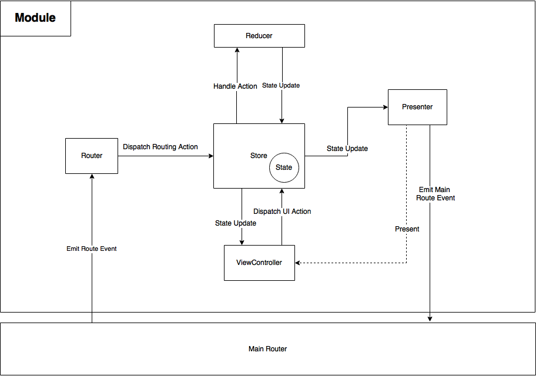

# Welcome to `Beaver` 

 

A delightful framework to build your iOS application made with love by developers at 

# Introduction

**Beaver is a framework** that includes everything needed to create iOS applications in Swift according to the main [Redux](https://github.com/reactjs/redux) principles.
We aim to set **new standards** in order to make iOS development **easier, more scalable and fully testable**.

A Beaver module is composed of:

- The **Store** stores the state which is representing what the views are showing at the screen. The state is immutable and can
  be only renewed by dispatching an action to the store. Whenever the state in the store changes, the store will notify all subscribers.
  
- The **Reducer** generates a new state given the current state and an action

- The **Router** generates an action given a route event, then dispatches it in the store.

- The **Presenter** subscribes to the store state update and presents the view controllers based on the current state.

- **ViewControllers** which subscribe to the store state update and builds their views based on the current state. They dispatch
  an action for each UI event and lifecycle event.
  
A Beaver application is composed of:

- At least one **Module** per feature.

- The **Main Store** stores the global state of the entire application and maintains it up to date. 

- The **Main Router** is the unique interface to send route events between modules.

- The **Main Presenter** subscribes to the main state update and presents the modules based on the current main state.

